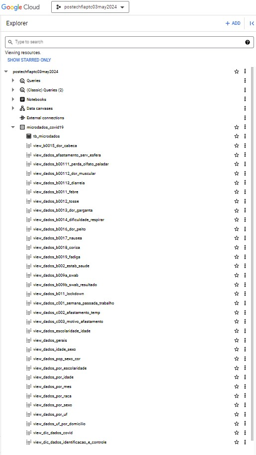

# Alura+Pós-Tech - TechChallenge 03 #

[Repositório] (https://github.com/carlosvneves/fiap_techchallenge03) da resposta ao TechChallenge 03 da turma 3DTAT-Pós-Tech.

[Aplicação] (https://fiaptechchallenge03-3dtat.streamlit.app/)

[Notebook de teste] (https://colab.research.google.com/drive/1iGatculTwjXTxH6aq4jIBL_0eUJ0MZmf?usp=sharing)


O trabalho foi desenvolvido em dupla:

- *Carlos Eduardo Veras Neves* - rm 353068
- *Emily da Silva Vaculik* - rm 352846

# Descrição do Problema

<div>
        <p>
          Imagine agora que você foi contratado(a) como Expert em Data Analytics por um grande hospital para entender como foi o comportamento da população na época da pandemia da COVID-19 e quais indicadores seriam importantes para o planejamento, caso haja um novo surto da doença.
        </p>
        <p>
          Apesar de ser contratado(a) agora, a sua área observou que a utilização do estudo do PNAD-COVID 19 do IBGE seria uma ótima base para termos boas respostas ao problema proposto, pois são dados confiáveis. Porém, não será necessário utilizar todas as perguntas realizadas na pesquisa para enxergar todas as oportunidades ali postas.
        </p>
        <p>
          É sempre bom ressaltar que há dados triviais que precisam estar no projeto, pois auxiliam muito na análise dos dados:
        </p>
        <ul>
          <li>
            <p>Características clínicas dos sintomas;</p>
          </li>
          <li>
            <p>Características da população;</p>
          </li>
          <li>
            <p>Características econômicas da sociedade.</p>
          </li>
        </ul>
        <p>
          O Head de Dados pediu para que você entrasse na base de dados do <a href="https://covid19.ibge.gov.br/pnad-covid/" rel="noopener" target="_blank">PNAD-COVID-19 do IBGE</a> e organizasse esta base para análise, utilizando Banco de Dados em Nuvem e trazendo as seguintes características:
        </p>
        <p>
          <span class="pos-color-magenta">a.</span>     Utilização de no máximo 20 questionamentos realizados na pesquisa;
        </p>
        <p>
          <span class="pos-color-magenta">b.</span>   Utilizar 3 meses para construção da solução;
        </p>
        <p>
          <span class="pos-color-magenta">c.</span>    Caracterização dos sintomas clínicos da população;
        </p>
        <p>
          <span class="pos-color-magenta">d.</span>    Comportamento da população na época da COVID-19;
        </p>
        <p>
          <span class="pos-color-magenta">e.</span>    Características econômicas da Sociedade;
        </p>
        <p>
          Seu objetivo será trazer uma breve análise dessas informações, como foi a organização do banco, as perguntas selecionadas para a resposta do problema e quais seriam as principais ações que o hospital deverá tomar em caso de um novo surto de COVID-19.
        </p>
</div>

# Base de dados

As tabelas e _views_ elaboradas para o trabalho estão disponíveis no Big Query, e foram construídas a partir da base de dados do próprio IBGE:

```sql

SELECT * FROM `basedosdados.br_ibge_pnad_covid.dicionario`

```

Um _print_ da base de dados pode ser vista abaixo:


